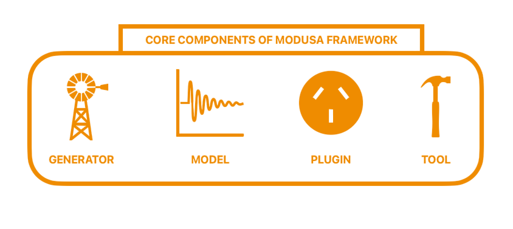

Core components
===============

   
.. admonition:: **These are the 4 core components of modusa framework**

      - **modusa Generator**: User-friendly interfaces for creating various modusa model instances.
      - **modusa Model**: Core signal representations that define the space and provide signal specific utilities.
      - **modusa Plugin**: A central hub for developers to contribute their work and for users to discover and integrate them.
      - **modusa Tool**: Specialized modules that handle complex tasks and heavy lifting computations.